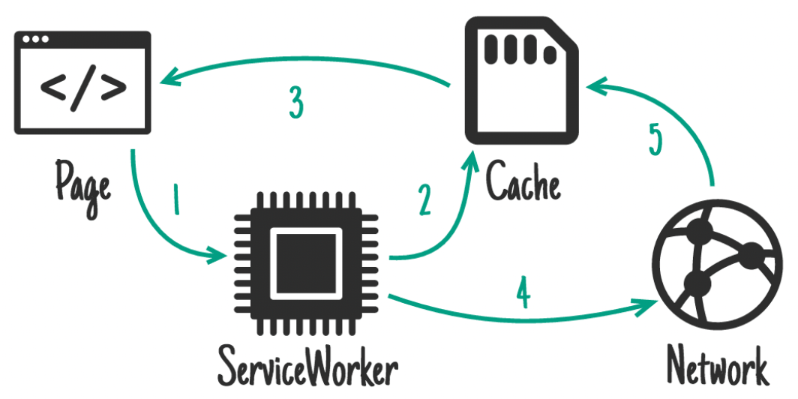
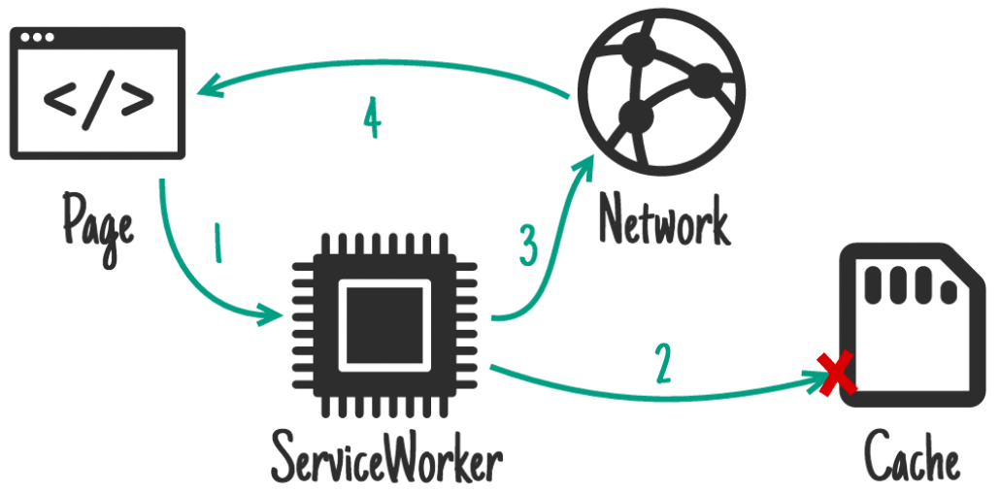
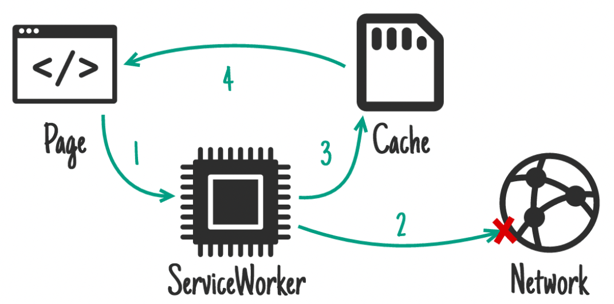

# Introduction to Service workers

Things to note about a service worker:

* It's a JavaScript Worker, so it can't access the DOM directly. Instead, a service worker can communicate with the pages it controls by responding to messages sent via the postMessage interface, and those pages can manipulate the DOM if needed.
* Service worker is a programmable network proxy, allowing you to control how network requests from your page are handled.
* It's terminated when not in use, and restarted when it's next needed.
* Service workers make extensive use of promises.

Service worker could be used for  `Offline Support`. It provides a programmatic way to cache app resources. Be it JavaScript files or JSON data from a HTTP request. The programmatic API allows developers to decide how to handle caching and provides a much more flexible experience than other options.

* Caching strategies (stale while revalidate)



* Caching strategies (Network first)



* Cashing strategies (cache first)



Service worker lifecycle
---


Let's look at simple example.

First of all we need to register it:

```js
if ('serviceWorker' in navigator) {
  window.addEventListener('load', function() {
    navigator.serviceWorker.register('/sw.js').then(function(registration) {
      // Registration was successful
      console.log('ServiceWorker registration successful with scope: ', registration.scope);
    }, function(err) {
      // registration failed :(
      console.log('ServiceWorker registration failed: ', err);
    });
  });
}
```

you can check that a service worker is enabled by going to chrome://inspect/#service-workers and looking for your site.

Then we need to install our service worker:

```js
const filesToCache = [
    '/',
    '/index.html',
    '/css/main.css',
    '/js/main.js'
];

const staticCacheName = 'pages-cache-v1';

self.addEventListener('install', event => {
    console.log('Attempting to install service worker and cache static assets');
    event.waitUntil(
        caches.open(staticCacheName)
            .then(cache => {
                return cache.addAll(filesToCache);
            })
    );
});
```

Inside of our install callback, we need to take the following steps:

* Open a cache.
* Cache our files.
* Confirm whether all the required assets are cached or not.

Now that we've installed a service worker, we probably want to return one of our cached responses.

After a service worker is installed and the user navigates to a different page or refreshes, the service worker will begin to receive fetch events, an example of which is below.

```js
self.addEventListener('fetch', function(event) {
    console.log('Handling fetch event for', event.request.url);

    event.respondWith(
        caches.open(staticCacheName).then(function(cache) {
            return cache.match(event.request).then(function(response) {
                if (response) {
                    console.log(' Found response in cache:', response);

                    return response;
                }
                console.log('No response for %s found in cache. About to fetch from network...', event.request.url);

                return fetch(event.request.clone()).then(function(response) {
                    console.log('Response for %s from network is: %O', event.request.url, response);

                    if (response.status < 400) {
                        cache.put(event.request, response.clone());
                    } else {
                        console.log('Not caching the response to', event.request.url);
                    }

                    return response;
                });
            }).catch(function(error) {
                console.error('  Error in fetch handler:', error);

                throw error;
            });
        })
    );
});
```

More info at [offline cookbook](https://web.dev/offline-cookbook/)
