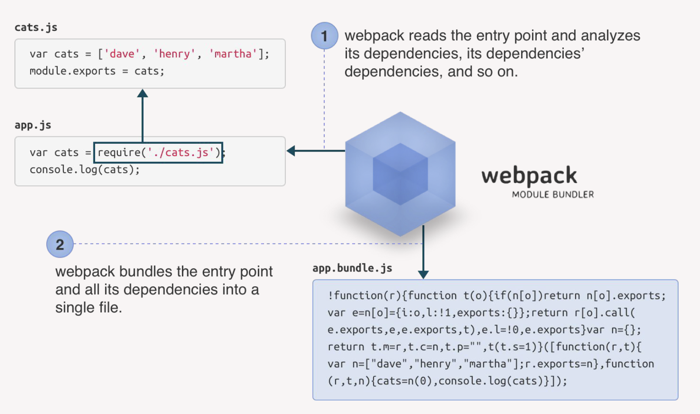

# Project with webpack

* Initialize a new npm project by using `npm init`.
* Let's look what webpack in our project will do.



Webpack will let for you to use JS modules and other new features:

```js
import lodash from 'lodash';
```

* Install webpack:

```bash
npm install webpack webpack-cli --save-dev
```

* Create the following directory structure, files and their contents:

```bash
  webpack-demo
   |- package.json
   |- index.html
   |- /src
       |- index.js
```

```js
function component() {
  const element = document.createElement('div');

  // Lodash, currently included via a script, is required for this line to work
  element.innerHTML = _.join(['Hello', 'webpack'], ' ');

  return element;
}

document.body.appendChild(component());
```

```html
<!DOCTYPE html>
<html>
  <head>
    <meta charset="utf-8" />
    <title>Getting Started</title>
    <script src="https://unpkg.com/lodash@4.17.20"></script>
  </head>
  <body>
    <script src="./src/index.js"></script>
  </body>
</html>
```

* Modify package.json

```js
{
    "name": "webpack-demo",
    "version": "1.0.0",
    "description": "",
    "private": true,
    "scripts": {
        "test": "echo \"Error: no test specified\" && exit 1"
    },
    "keywords": [],
    "author": "",
    "license": "MIT",
    "devDependencies": {
        "webpack": "^5.38.1",
        "webpack-cli": "^4.7.2",
    }
 }
```

Creating a bundle
---

* Add *dist* directory with index.html

```bash
  webpack-demo
    |- package.json
    |- /dist
        |- index.html
    |- index.html
    |- /src
        |- index.js
```

* Install lodash

```js
npm install --save lodash
```

* Change *index.js*

```js
import _ from 'lodash';

function component() {
    const element = document.createElement('div');
    element.innerHTML = _.join(['Hello', 'webpack'], ' ');

    return element;
}

document.body.appendChild(component());
```

* Modify *dist/index.html*

```html
<!DOCTYPE html>
<html>
<head>
    <meta charset="utf-8" />
    <title>Getting Started</title>
</head>
<body>
    <script src="main.js"></script>
</body>
</html>
```

* Let's run *npx webpack*, which will take our script at src/index.js as the entry point, and will generate dist/main.js as the output.
* As of version 4, webpack doesn't require any configuration, but most projects will need a more complex setup, which is why webpack supports a configuration file. We will skip webpack configuration since in most modern frontend framework like *React* of *Angular* you already get preconfigured set up.
* Let's modify *package.json* for the last time:

```json
{
   "name": "webpack-demo",
   "version": "1.0.0",
   "description": "",
   "private": true,
   "scripts": {
    "test": "echo \"Error: no test specified\" && exit 1"
    "build": "webpack"
   },
   "keywords": [],
   "author": "",
   "license": "ISC",
   "devDependencies": {
     "webpack": "^5.4.0",
     "webpack-cli": "^4.2.0"
   },
   "dependencies": {
     "lodash": "^4.17.20"
   }
 }
```

Now we can use `npm run build` instead of `npx webpack`