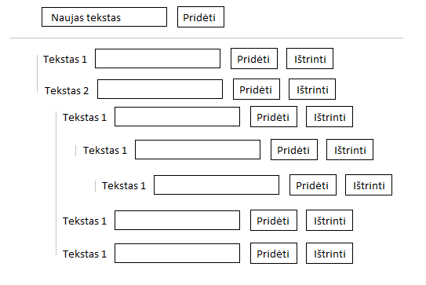

# Quiz

Sukurti “dinaminį medį” javascript, html, css pagalba, t.y. pradžioje turim textbox’a ir mygtuką sukurti pirmo lygio item’us, o kai yra pirmo lygio item’ai, juose galima kurti “child” item’us ir t.t.

---

